# Create and Configure Discord Channels

## Introduction

In this section, you will create and organize text/voice channels, then configure permissions so the right people can post in the right places.

A clear channel structure reduces noise, keeps project communication organized, and helps team members find information quickly.

---

## Prerequisites

- You have already completed server setup (Task 2).
- You have permission to manage channels in the server.
- Your team has agreed on basic communication rules.

!!! note
    This channel structure is optimized for  team collaboration, not large public communities.

---

## Recommended Channel Structure (3–10 Member Team)

- announcements (important updates only)
- general (daily team chat)
- meeting-agenda (topics before meetings)
- meeting-minutes (notes after meetings)
- resources (shared links/files)
- Team Meeting Room (voice channel)

---

## Setup Steps

1. After you **Enable** [Community], Discord automatically creates [#rules] and [#moderator-only].  
    - [#rules]: By default, this channel appears at the top with a special header. You can post your server rules and team meeting agreement here.  
    - [#moderator-only]: Discord sends Community-related updates here for admins/moderators. Some information may be sensitive, so only the server owner can view it by default.  
   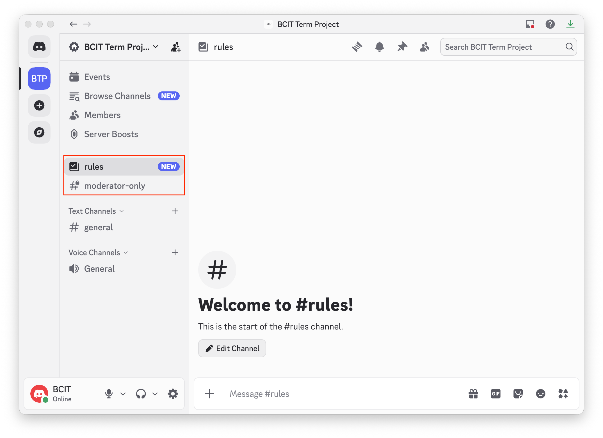  
!!! note
    These two channels cannot be directly deleted at first. You must first reassign their Community responsibilities to other channels, then remove channels that no longer hold those roles.

2. To create a new text channel, hover over [Text Channels] and **Click** [+].  
   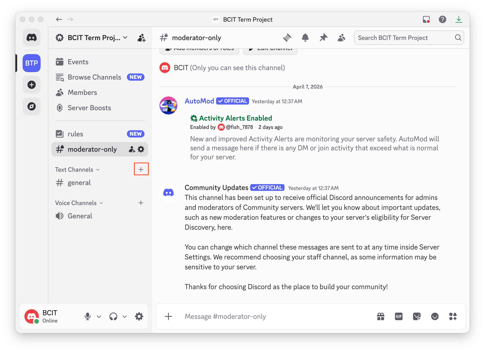

!!! note
    If you have any problems with creating channel, please check [Troubleshooting](troubleshooting.md).

3. **Select** [Text], **Type** a [Channel Name] (for example, "announcements"), then **Click** [Create Channel].  
   

4. To create a voice channel, hover over [Voice Channels] and **Click** [+].  
   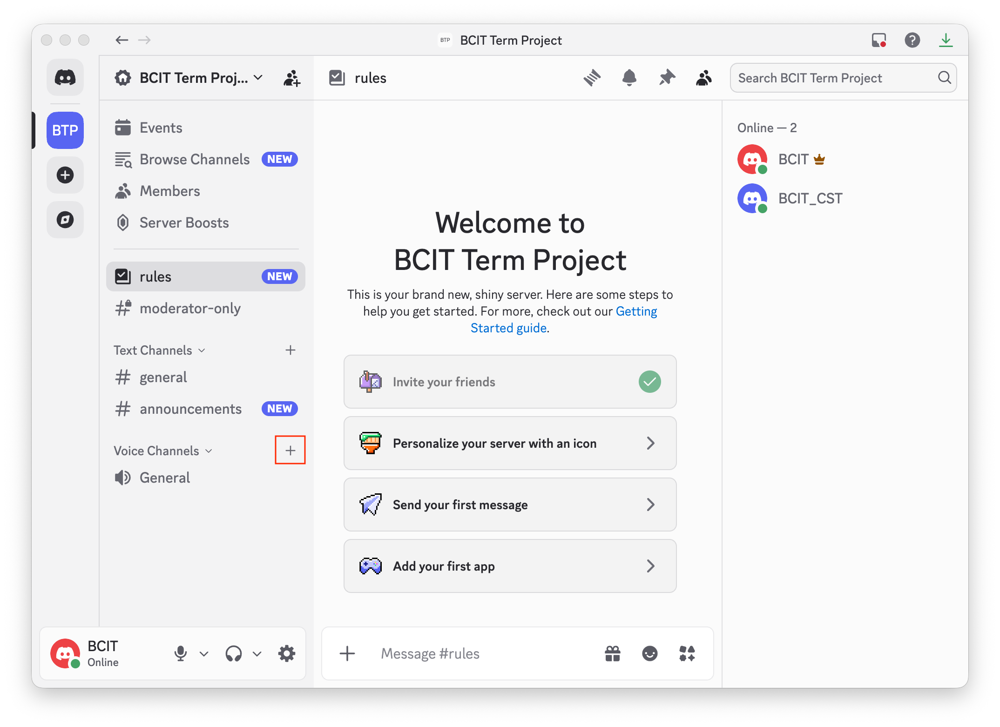

5. **Select** [Voice], **Type** a [Channel Name] (for example, "Team Meeting Room"), then **Click** [Create Channel].  
   **Why:** This gives your team a dedicated space for live discussion.  
   

6. To edit a channel, hover over the channel, right-click, and **Select** [Edit Channel].  
   **Why:** For example, you may want to limit posting permissions in [#announcements].  
   

7. In [Overview], **Type** a short description in [Channel Topic] to explain the channel purpose.  
   **Why:** Clear channel purpose reduces confusion and improves communication consistency.  
   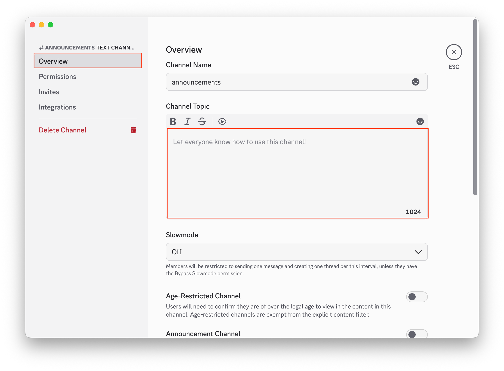

8. In [Permissions], **Click** [Advanced Permissions].  
   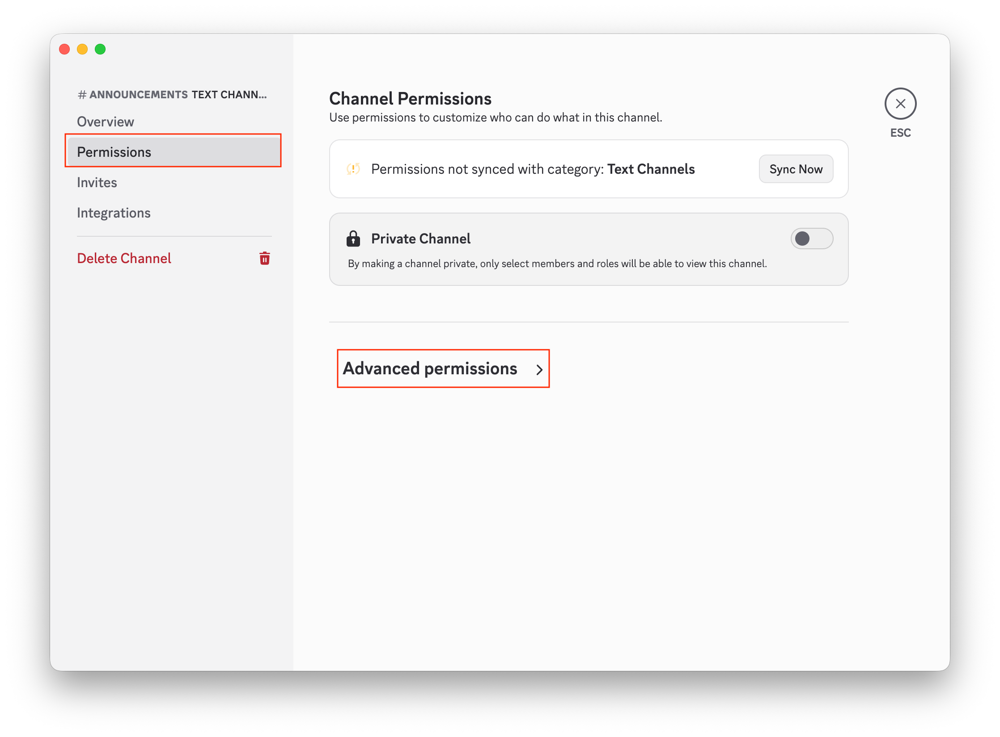

9. Under [ROLES/MEMBERS], confirm [@everyone] is selected. Then scroll to [Text Channel Permissions] → [Send Messages] and **Click** the red [X] to deny posting for everyone.  
   See this first:  
   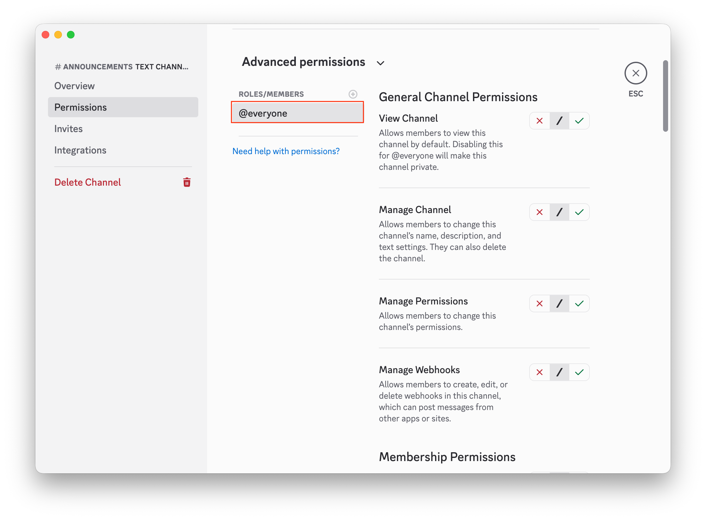  
   Click this:  
   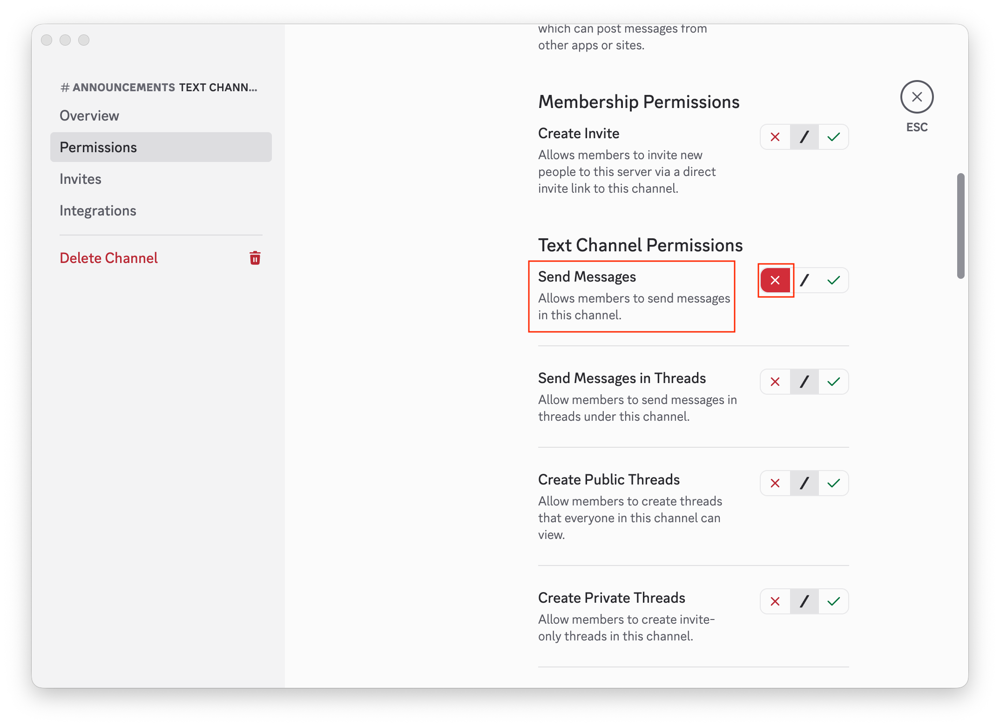

10. Scroll up and **Click** [+] next to [ROLES/MEMBERS]. When members appear, **Select** a specific member (or role).  
   Click [+]:  
   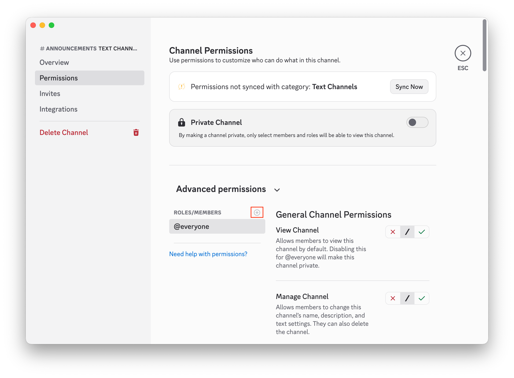  
   Member list appears:  
   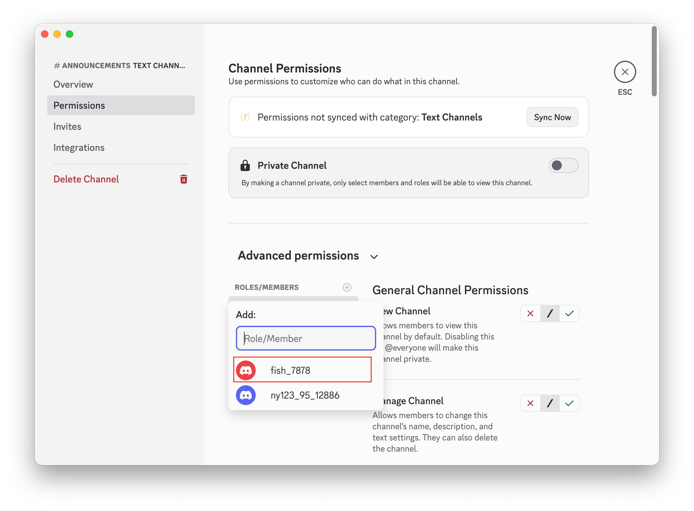

11. Scroll down to [Send Messages], then **Click** the green [✓] to allow posting for that selected member/role. **Click** [Save Changes], then **Press** [Esc] (top-right) to exit [Edit Channel].
   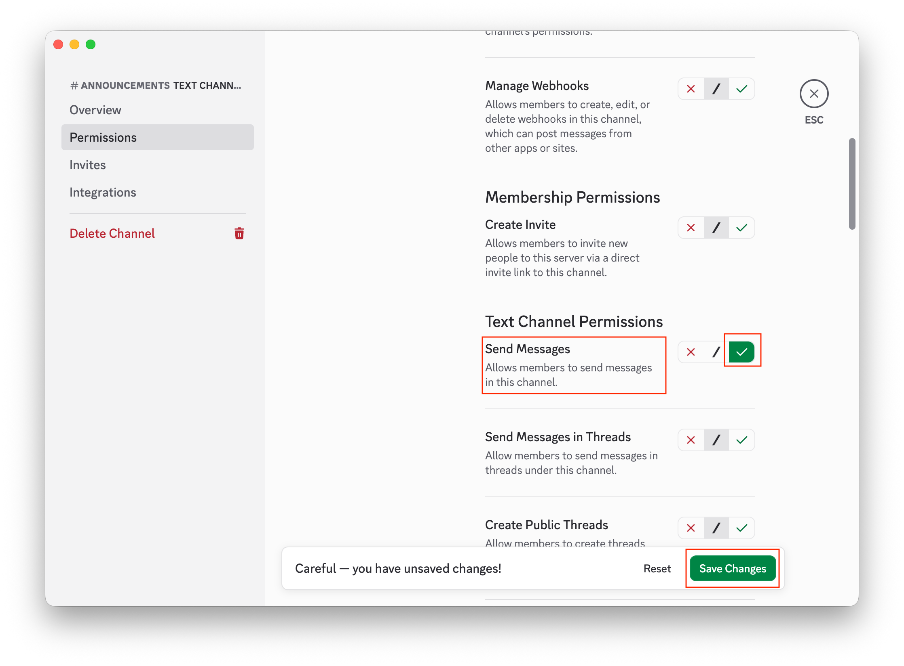  
   Exit [Edit Channel]:  
   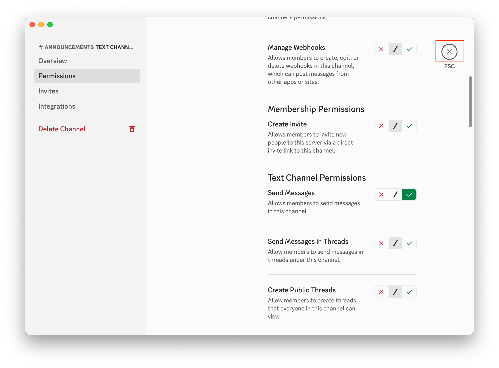

12. If you want to remove a channel, hover over it, right-click, and **Click** [Delete Channel].  
   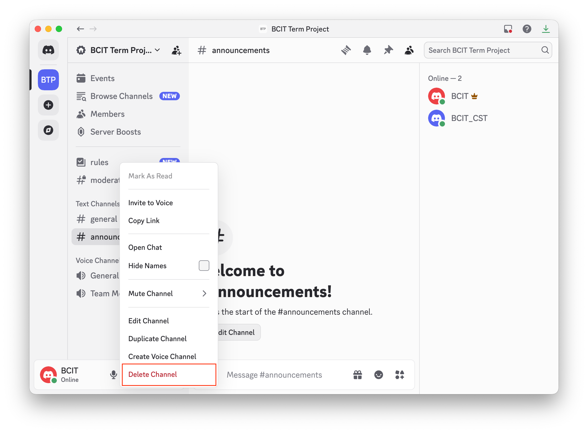

!!! success
    Core channel management training is complete and ready for team collaboration.

---

## Conclusion

Your Discord channel setup is now complete and structured for effective team collaboration.  
You have configured channel types, channel purpose descriptions, and permissions so communication stays clear, organized, and role-appropriate.

