# Hosting a Team Meeting

## Introduction

Discord allows users to host voice or video meetings using voice channels. This guide will walk you through how to start and manage a team meeting effectively.

---

## Prerequisites

Before starting, make sure you have:
- A Discord server
- Permission to use your microphone and camera

---

## Start a Meeting

After joining a server, you can host a meeting with your classmates or teammates. This section will show you how to start a team meeting.

1. The left sidebar displays all the servers you’ve joined. Click the server where you want to host your meeting.
    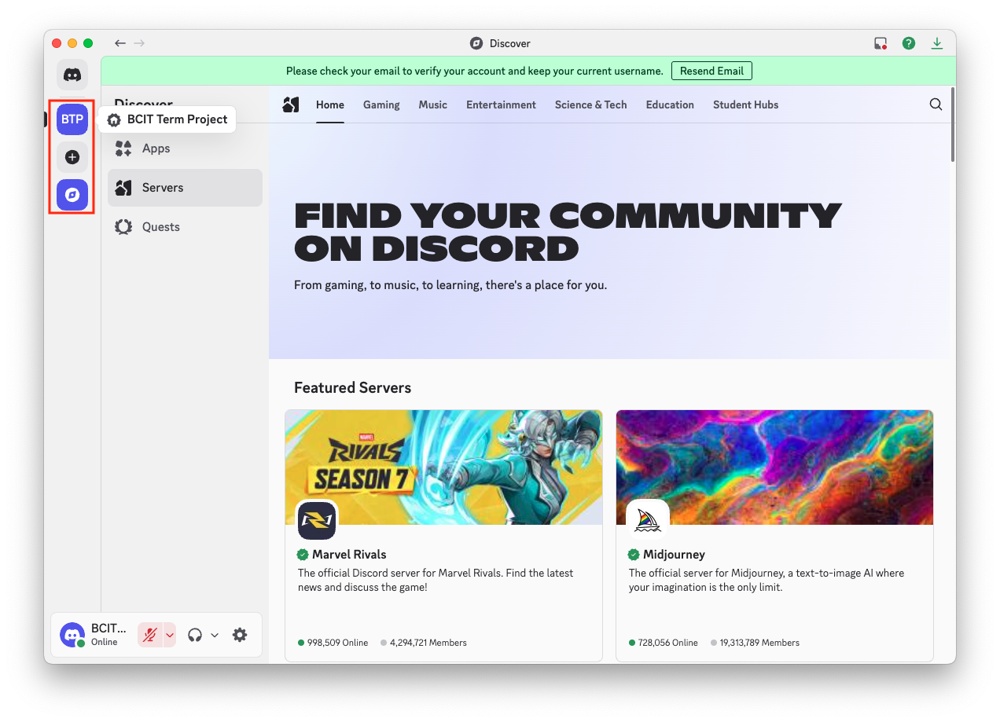

2. Select a voice channel where you want to start the meeting.
    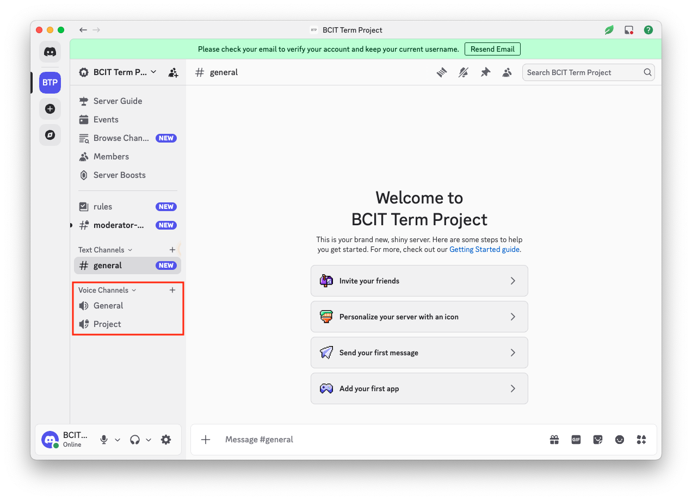

3. Click the “Invite to Voice” icon to invite your classmates
    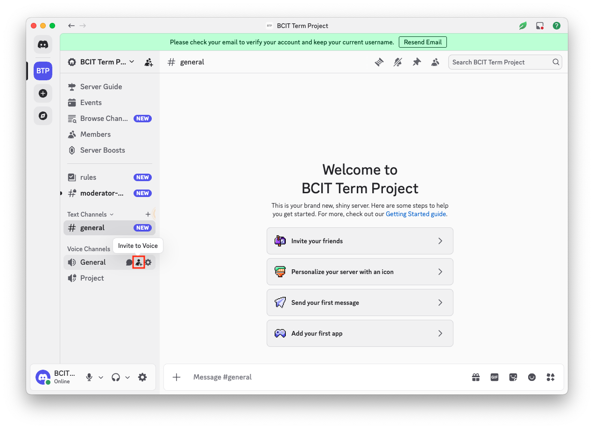

    !!! warning
        Clicking anywhere else in the channel will immediately start a voice meeting.

4. Choose who you want to invite and click Invite, or share the invite link with your classmates.
    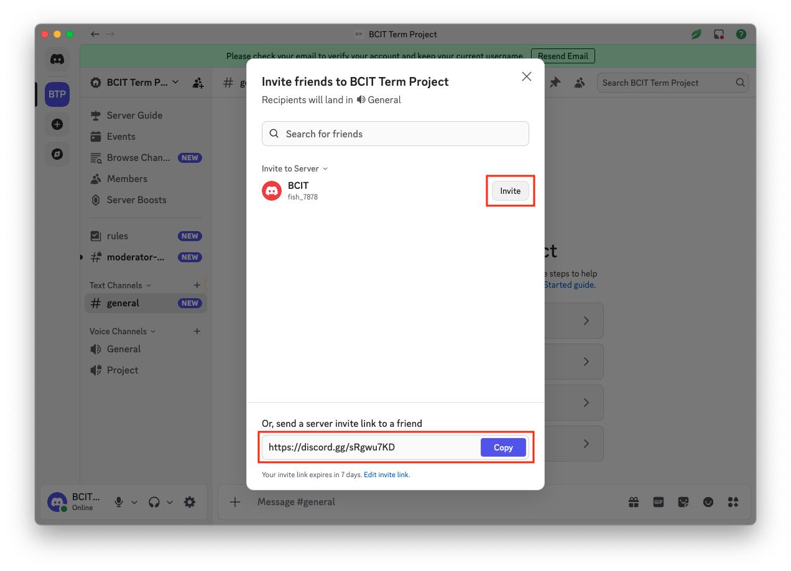

5. Click the voice channel to begin the meeting.
    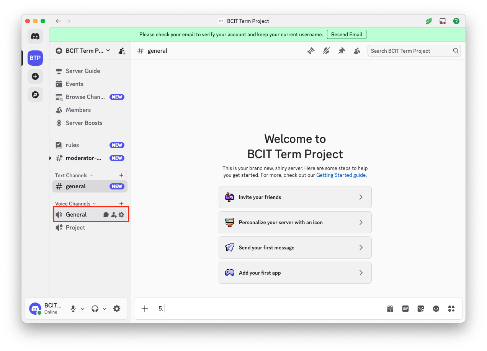

6. You are now in a voice meeting.
    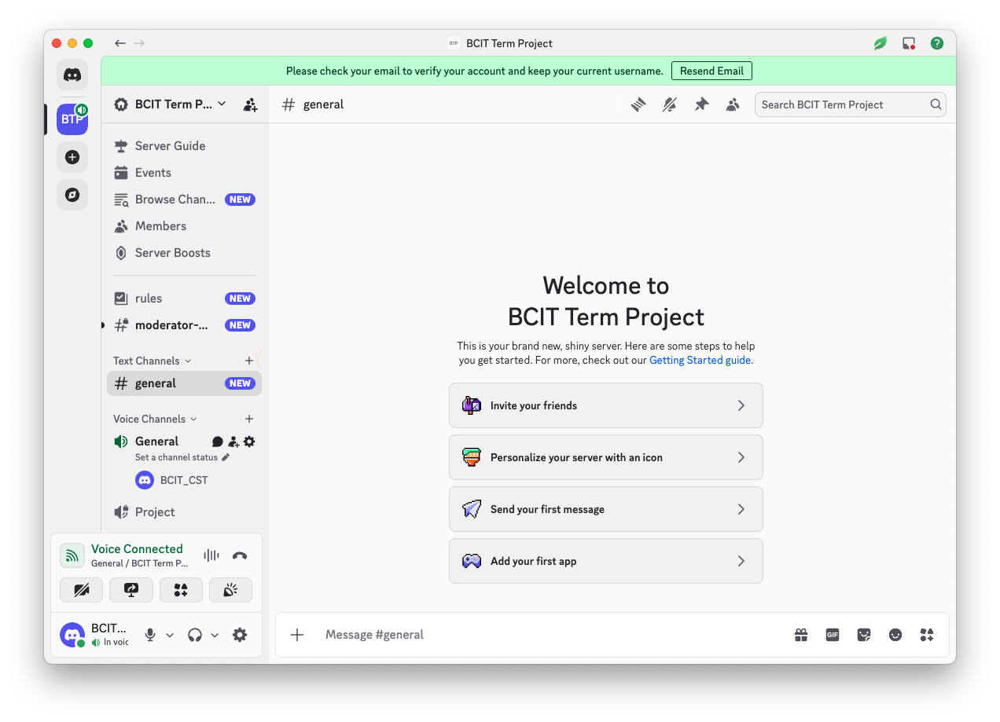

    !!! success "Voice meeting started"
        You have successfully start a voice meeting.

7. Click the screen share icon to present your screen to others.
    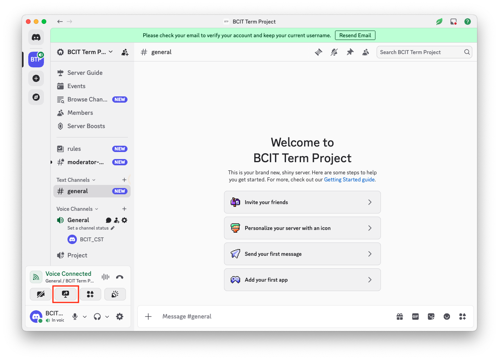

8. Click camera icon to turn on your camera.
    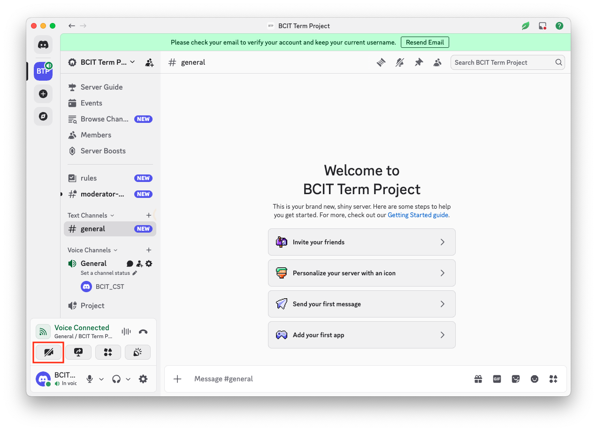

9. Once your camera is on, your meeting becomes a video meeting.
    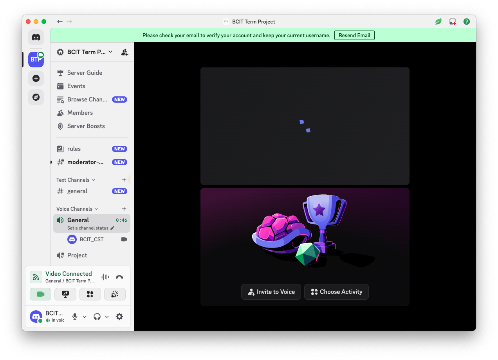

    !!! success "Video meeting started"
        You have successfully start a video meeting.

10. Use the microphone icon to mute or unmute yourself.
    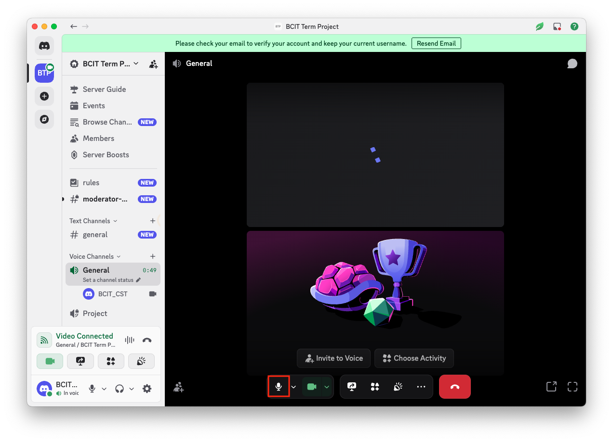

11. Click the red disconnect button to leave and end the meeting.
    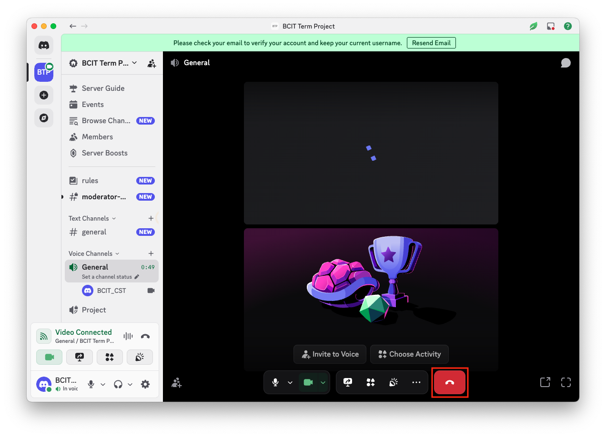

---

## Conclusion

You have now learned how to:

- Start a voice meeting
- Invite participants
- Use screen sharing and video
- Manage audio controls
- End a meeting

You’re ready to host a team meeting and collaborate with your teammates on Discord!

