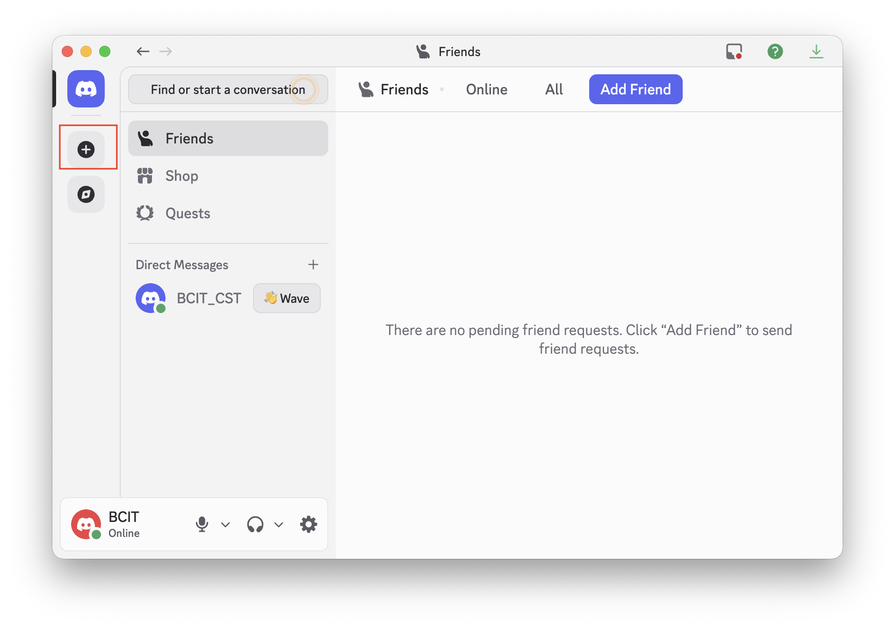
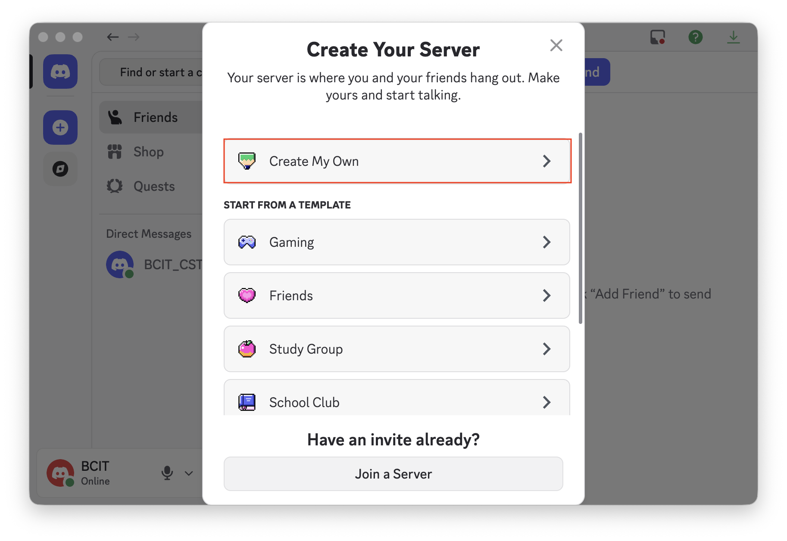
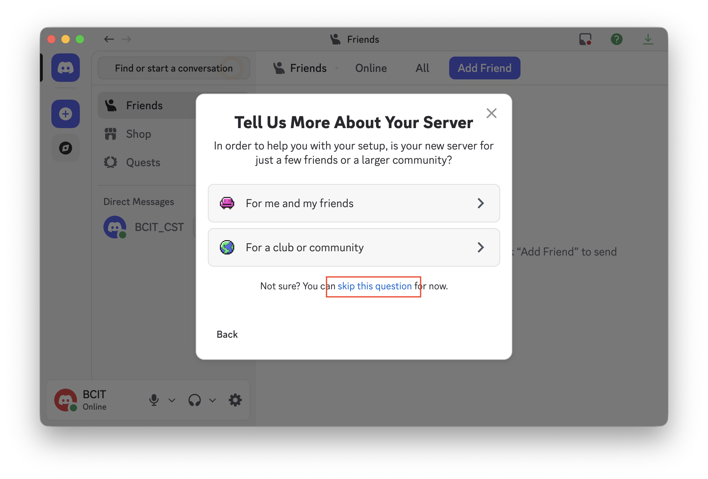
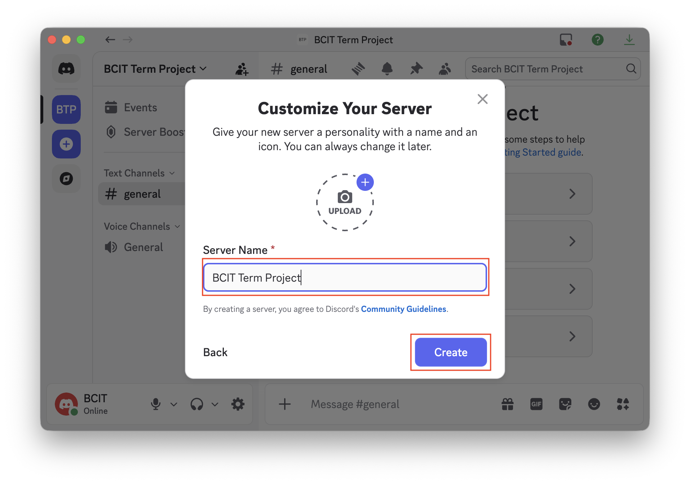

# Task 2: Create and Configure a Discord Server

## Introduction

This section explains how to create and configure a Discord server for team collaboration using essential server-level settings.

For more information about Discord features, visit the [Discord website](https://discord.com).

---

## Prerequisites

- You have a Discord account and are signed in.
- You are using Discord desktop app or web version.
- You know the purpose of your server (for example, term project team collaboration).

!!! note
    Discord desktop is recommended because server settings are easier to navigate.

---

## Setup Steps

1. Open Discord and click **+ (Add a Server)**.  

2. Select **Create My Own** and choose the server type.  
   **Why:** This creates a custom server suited to your team’s use case.

3. Choose the server purpose, if not sure. can skip this question.

4. Enter a clear server name and click **Create**.  
   **Why:** A clear name helps teammates identify the correct server quickly.
   

4. Open the server dropdown and click **Server Settings**.  
   **Why:** All core configuration options are managed in Server Settings.

5. In **Overview**, confirm server name and upload a server icon, then save.  
   **Why:** Basic identity settings make the server recognizable and professional.

6. In **Enable Community**, complete setup (recommended).  
   **Why:** Community setup enables useful management and baseline safety features.

7. In **Safety Setup/Moderation**, set **Verification Level** to at least **Medium**.  
   **Why:** Verification helps prevent spam or fake accounts from posting immediately.

8. Enable available content/media safety filters and save.  
   **Why:** These filters reduce inappropriate content and keep collaboration space clean.

9. Set default notifications to **Only @mentions**.  
   **Why:** This reduces notification overload while preserving important alerts.

10. Configure invite link expiration and max uses in **Invite People → Edit Invite Link**.  
    **Why:** Restricted invite links improve access control and reduce unauthorized sharing.

!!! success
    Core server setup is complete and ready for your next tasks.

---

## Conclusion

Your Discord server is now created and configured with essential identity, safety, notification, and invite settings.  
This provides a strong foundation for the next implementation steps in your project workflow.