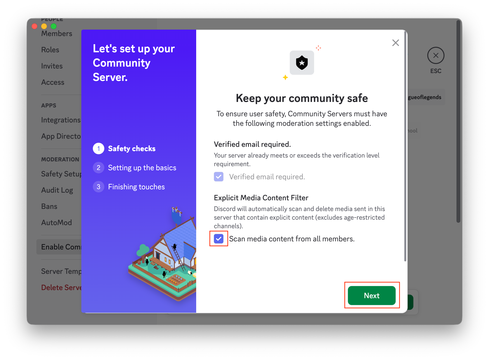
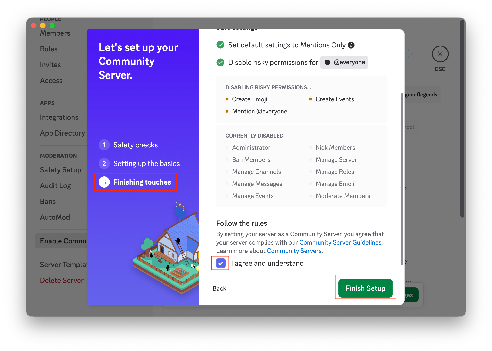
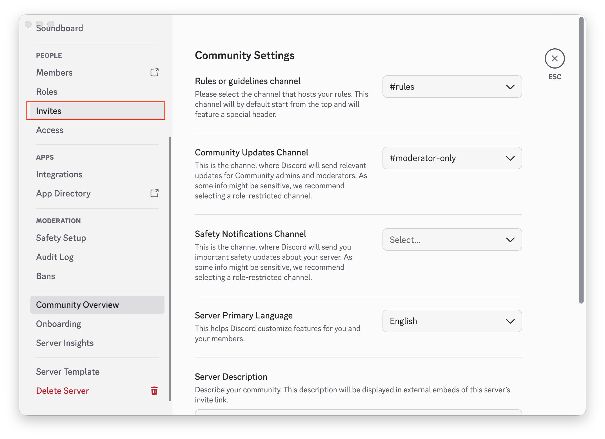
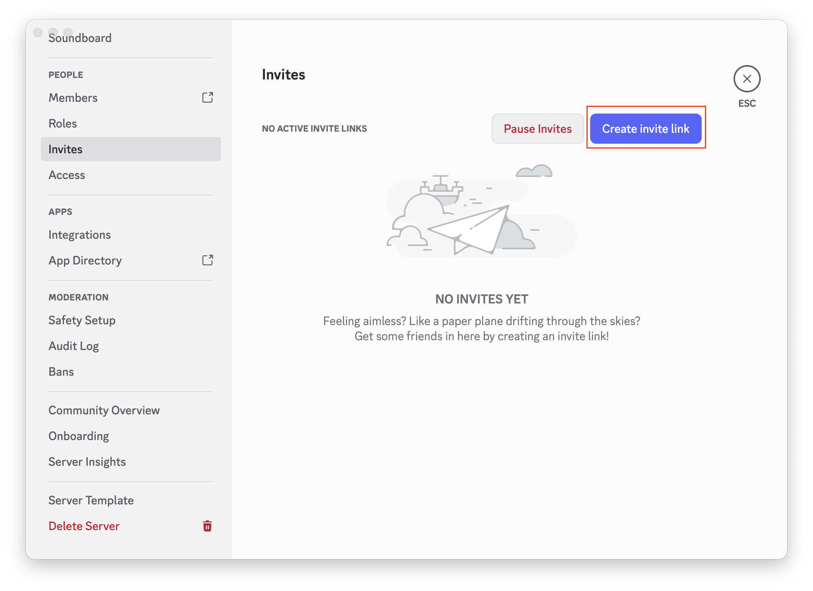
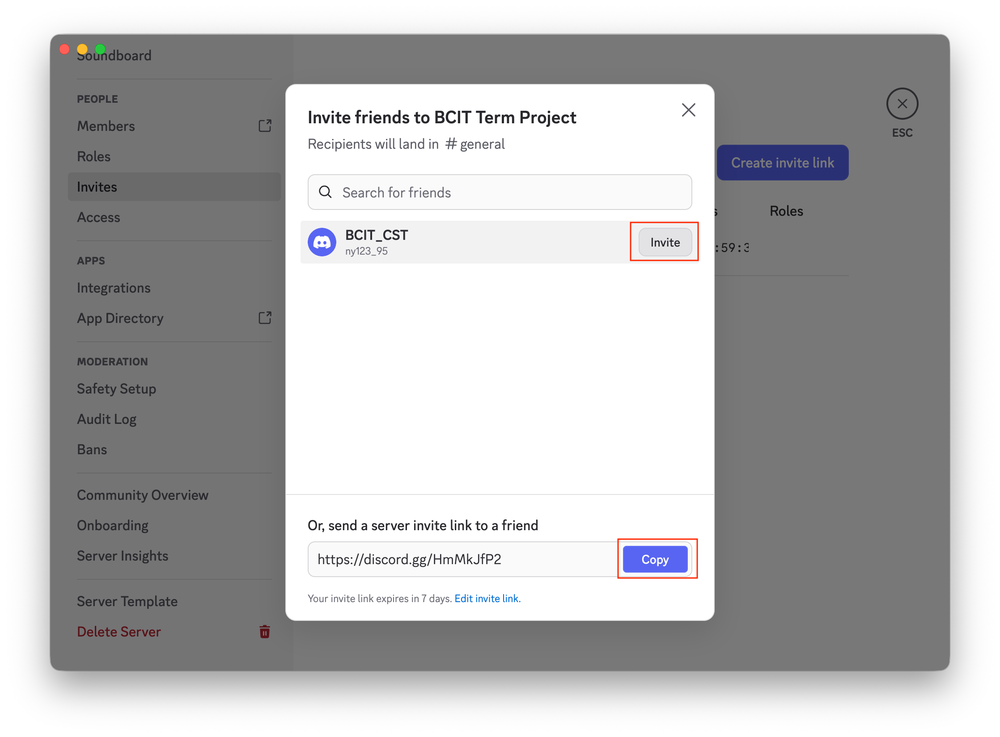

# Create and Configure a Discord Server

## Introduction

In this section, you will configure the server-level settings your team depends on: server name, privacy/safety options, roles, and invite access.

A properly configured server creates a stable foundation for collaboration before channels and meetings are set up.

---

## Prerequisites

- You have a Discord account and are signed in.
- You are using the Discord desktop app or web version.
- Your team size is 3–10 members.

!!! note
    This setup is optimized for private team collaboration, not public community servers. Public community servers require stricter safety and moderation configuration.

---

## Recommended Configuration (3–10 Member Team)

- Default Notifications: Only @mentions  
- Invite Expiration: 7 days  
- Invite Max Uses: 10–20  
- Safety Filters: Enabled

---

## Setup Steps

1. **Open** Discord and **Click** [+ (Add a Server)].  

2. **Select** [Create My Own] and **Choose** the server type.  
   **Why:** This creates a custom server suited to your team’s use case.  

3. **Choose** the server purpose. If you are unsure, you can skip this question.  

4. **Type** a clear server name and optionally add an icon, then **Click** [Create].  
   **Why:** A clear name helps teammates identify the correct server quickly.  

5. **Open** the server dropdown and **Click** [Server Settings].  
   **Why:** All core configuration options are managed in [Server Settings].  
  
   The dropdown menu should appear as shown below.  

6. In [Server Settings], scroll to the bottom of the left sidebar and **Click** [Enable Community]. On the right side, **Click** [Enable Community] again to start setup.  
   **Why:** Community setup enables useful management and baseline safety features.  

7. In [Community Setup], complete [Safety Checks], **Check** [Scan media content from all members], then **Click** [Next].  
   **Why:** These filters reduce inappropriate content and keep the collaboration space clean.  

8. In [Community Setup], Discord may auto-skip [Setting Up the Basics] by applying defaults (for example, Mentions Only notifications and disabling risky permissions for @everyone). When you reach [Finish Touches], **Check** [I agree and understand], then **Click** [Finish Setup].  
   **Why:** This reduces notification overload while preserving important alerts.  

9. After setup completes, you may hear a Discord notification sound. This is normal; you can review notifications later. Then **Click** [Invites] in the left sidebar.  

10. In [Invites], find [Create Invite Link] on the right side and **Click** it.  

11. In the pop-up window, choose one option:  
      - **Click** [Invite] to let Discord send an invite directly.  
      - **Click** [Copy] to copy the invite link and send it manually to your teammate.  

!!! success
    Core server setup is complete and ready for your next tasks.

---

## Conclusion

Your Discord server is now configured for team collaboration with appropriate identity, safety, notification, and invite settings for a 3–10 member team.

