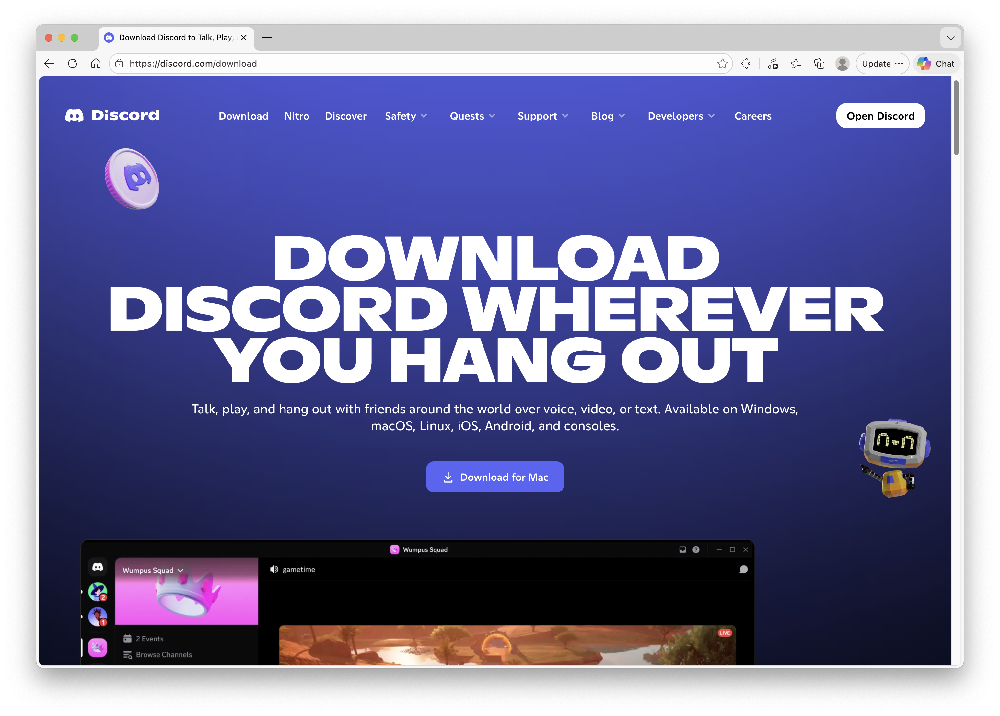

# Getting Started

Discord is a communications platform that enables you to communicate with lecturer and classmates during your time in BCIT. We will go through how to set up Discord application and register account, and How to add friends.

## Download Discord Application

You need to download Discord application to enjoy a more stable Discord experience. This section will show you how to download a free Discord application.

1. Go to [Discord download page](https://discord.com/download) and click [Download for Mac] button in the middle.
   

2. Open the downloaded file from your Downloads folder.

3. Drag the Discord icon into the Applications folder.

4. Open the Applications folder and launch Discord.

## Register Account
