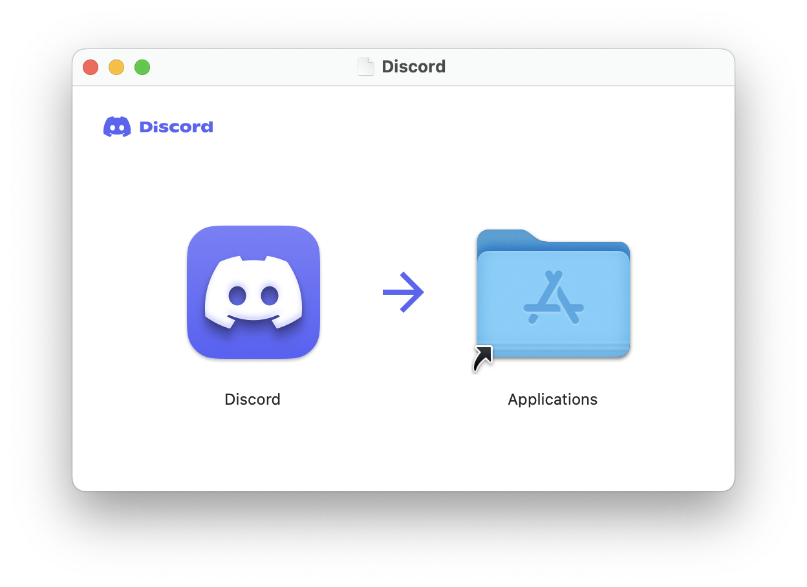
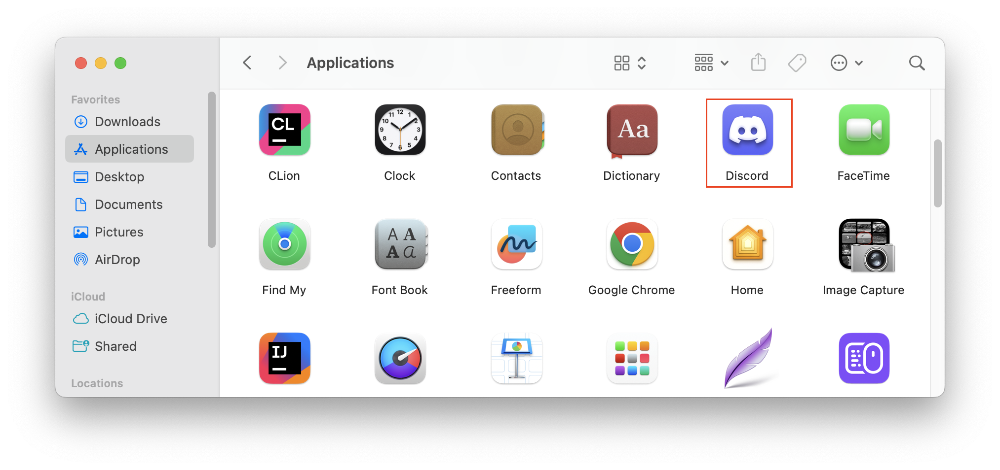

# Getting Started

Discord is a communications platform that enables you to communicate with lecturer and classmates during your time in BCIT. We will go through how to set up Discord application and register account, and How to add friends.

## Download Discord Application

You need to download Discord application to enjoy a more stable Discord experience. This section will show you how to download a free Discord application.

1. Go to [Discord download page](https://discord.com/download) and click "Download for Mac" button in the middle.
   

2. Open the downloaded file from your Downloads folder and drag the Discord icon into the Applications folder.
   

3. Open the Applications folder and click Discord icon to launch Discord.
   

## Register Account

You need to create an account in order to use Discord. This section will show you how to register a free Discord account.

1. Click "Register" to create a new account.
   

2. Enter your email address, username, password, date of birth and click "Create Account" button.
   

3. Account created and direct to the main page. You can verify your email now or later by clicking link your received in you mail box.
   

## Add Friend

After creating an account, you can add your classmates to start a conversation with them. This section will show you how to add friend in Discord.

1. Click "Friends" button direct to friends manage page.
    

2. Enter the username of your friends and click "Send Friend Request" button.
   
